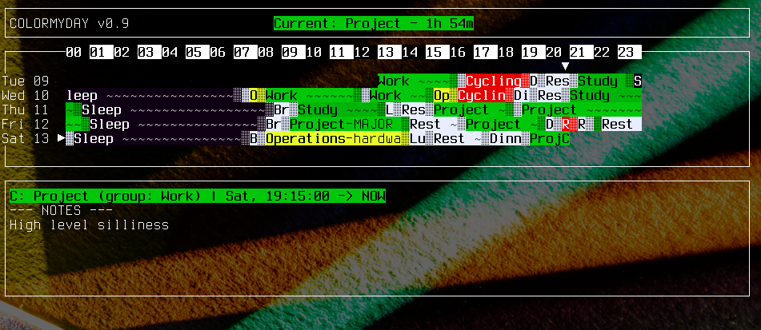

Version 0.9

### About

`colormyday` is the colorful day visualizer for the terminal. Display your personal history by recording your activities in real-time or after the fact.

### Features

* **vim-like UX:** move through time with `hjkl` and other keys. Use command-line mode with `:begin` and the like.
* **custom colors and groups:** activities can be grouped into groups. Configure your group color palette.
* **activity notes:** add detail to your activities.
* **scriptable interaction:** begin and end events from the command line (see "script mode" below):

	```
	$ colormyday begin "Side Project"
	$ colormyday end
	```
See quick start.

### Installation

*I believe it'll work on your system. You might need to get a few dependencies. Just do this:*

If installing from this repo, you need the autotools:

	$ ./autogen.sh
	$ ./configure
	$ make && sudo make install

### Quick start

If they do not exist, directories will be created at your `--confdir` and `--datadir` parameters, or your XDG paths, or in home (by checking in that order of priority).

#### Curses mode

To run in curses mode, do `$ colormyday`. The thin top window indicates your program's version, your current activity, and the time for how long you've been doing said activity. The large middle window will draw out events. Your cursor is the "C" character, and you can move it with `hjkl`, `wb$0`, and `gG` as you would in vim. The bottom window displays data about the event under your cursor.

You can begin or end events by entering command-line mode with `:`. Curses-mode commands are parsed in much the same way as script-mode command-line arguments. See the next section for details. For example, executing `:begin Exercise --late 2021-5-2-15-00` will end the current activity (if one exists) retroactively at 3pm, May 2nd, 2021 and record a new event "Exercise" as having begun at the same time. "Exercise" then becomes the current activity.

You can edit the selected event with `:edit`. This opens its data file in nano, and you can add notes or change its name. Some commands, like `show`, are available in script mode but not in curses. Others, like `edit`, are the opposite way.

If you leave curses mode open, you should see the events drawn in real-time. To use colors, you'll need to put activities in groups. See the description of groups in `datadir & confdir `.

#### Script mode

	$ colormyday begin Sleep
	$ colormyday end --late 2021-5-2-22-30
	$ colormyday show 10 // actually, not yet

The `begin` action starts recording an event. `end` ends the current event. `show` displays the last given number of events. See the manpage for a complete list of options.

#### datadir & confdir

Datadir and confdir are specified by the `--datadir` and `--confdir` command-line options or XDG envvars (in that order), and default to `~/.colormyday/data/` and `~/.colormyday/` respectively. They are created if they do not exist.

Activities (aka "events") will be stored one-per-file in datadir. Filenames identify start and end-times in unix time (ex: `1620107063-1620153206` or just `1620107063` for current activities).

Groups are stored in the `groups` file in confdir.

	<groups>
		<group>
			<title>SLEEP</title>
			<color>170024</color>
			<members>
				<event>Sleep</event>
			</members>
		</group>
		<group>
			<title>work</title>
			<color>29c702</color>
			<members>
				<event>Projects</event>
				<event>Academic</event>
				<event>Personal</event>
			</members>
		</group>
	</groups>

This example file describes two groups: their names, colors, and member activities. All members will be drawn in the color of the group. The hex colors will be approximated by curses.

**For more information, see the manpage**
